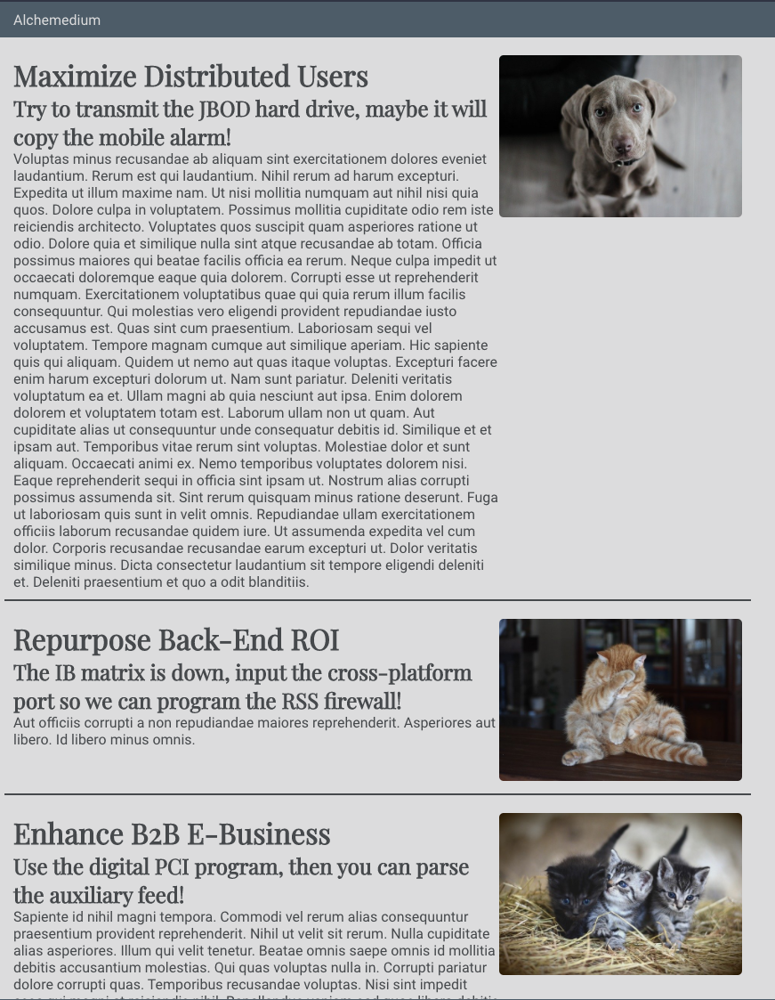

# Making a List of Blogs

### Getting Started

_Use [this repository](https://github.com/alchemycodelab/react-blog-list) as a template for this deliverable._
Environment variables have been provided for you because we will all be using the same supabase database. Remove the `.example` from .`env.development.local.example` and `.env.test.local.example`

[Managing Environment Variables](https://github.com/alchemycodelab/student-resources/blob/main/curriculum-notes/react/lecture-notes/03d-react-environment-variables.md)

### Learning Objectives

- Use useEffect hook with a dependency array to retrieve data when a component first mounts
- Use useState to manage component state
- Use custom hooks to bundle together multiple useState & useEffect calls
- Use the Supabase Javascript client to retrieve data from a database
- Use the network tab to examine (and debug) the request being sent to a server and the response received from a server
- Use the async/await pattern to make our asynchronous code easier to read

### Description

For this deliverable, you will be using supabase to retrieve a list of blogs from an existing database. The table has the following schema:

| blogs      |                   |
| ---------- | ----------------- |
| id         | int - primary key |
| author_id  | int - foreign key |
| created_at | date              |
| title      | varchar           |
| subtitle   | varchar           |
| text       | varchar           |
| image.     | varchar           |

It will end up looking like this:

### Acceptance Criteria

- A user should see a list of blog posts when they load the page
- There should be a function called `getBlogs` in the services layer which calls Supabase and returns all the columns from the `blogs` table
- There should be a custom hook called `useBlogs` which returns the list of blogs
- `useBlogs` hook should have a state variable called `blogs` that defaults to an empty array
- `useBlogs` hook should have a `useEffect` hook to call `getBlogs` from the services layer asynchronously and then set the returned data in state
- There should be a component called `<Main>` which uses the `useBlogs` hook to get the list of blogs
- Main component should map through each item in `blogs` and create a `<BlogCard>` component for each blog item
- All tests should pass

### Rubric

| Task                                                                                        | Points |
| ------------------------------------------------------------------------------------------- | ------ |
| getBlogs function in `services` folder calls Supabase and retrieves the list of blog posts  | 2      |
| `blogs` state variable created using `useState` with the proper default in useBlogs hook    | 2      |
| `useEffect` in `useBlogs` hook correctly calls supabase when the component is first mounted | 2      |
| each blog is correctly rendered using the `BlogCard` component                              | 2      |
| All tests are passing                                                                       | 2      |

### Stretch Goal (worth up to 1 additional points)

- The blogs table has a foreign key relationship to a table called authors update the BlogCard to include the author's name by including author in the supabase call
